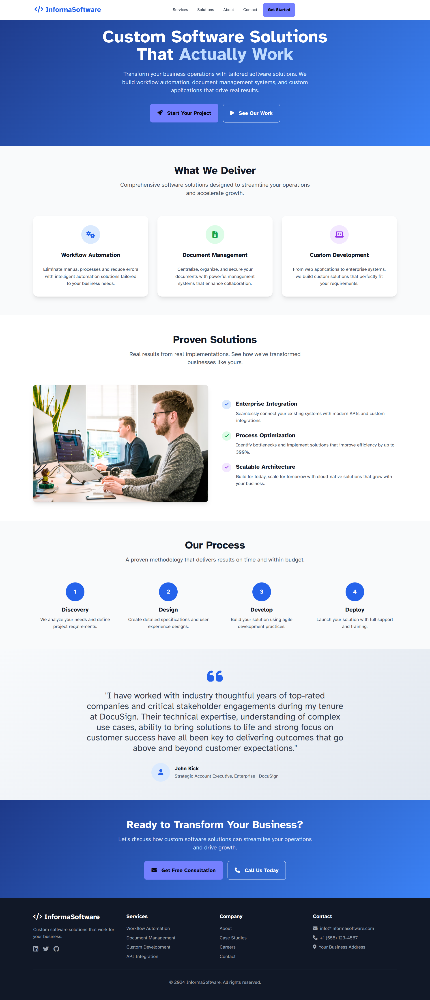

# InformaSoftware - Website Redesign + SEO Optimization
https://www.informasoftware.com/

I've created a modern, professional redesign of the InformaSoftware homepage. The redesign transforms the original cluttered layout into a clean, conversion-focused experience that better communicates InformaSoftware's value proposition to B2B prospects.

**Here are the key improvements:**

## Design Features:
- Clean, minimal B2B-focused design with professional blue gradient hero
- Responsive layout that works on all devices
- Semantic HTML5 structure with proper accessibility
- Modern card-based layouts with subtle hover animations
- Strategic use of white space for better readability

## Technical Implementation:
- Semantic HTML with proper heading hierarchy and ARIA labels
- Tailwind CSS for responsive styling + DaisyUI components
- Font Awesome icons throughout
- Atkinson Hyperlegible font for accessibility
- Hero image for visual appeal
- Smooth scrolling navigation and interactive elements

## Content Strategy:
- Clear value proposition in hero: "Custom Software Solutions That Actually Work"
- Benefit-focused headlines vs. feature-focused
- Social proof with DocuSign testimonial
- Strong CTAs throughout the page
- Improved messaging hierarchy

## SEO Optimizations:
- Proper meta description and title tags
- Semantic HTML structure (h1, h2, h3 hierarchy)
- Alt text for images
- Clean URL structure ready for implementation
- Fast-loading with optimized resources